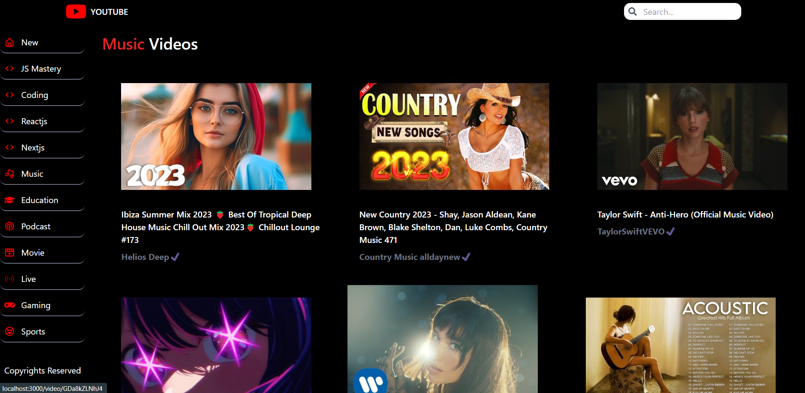
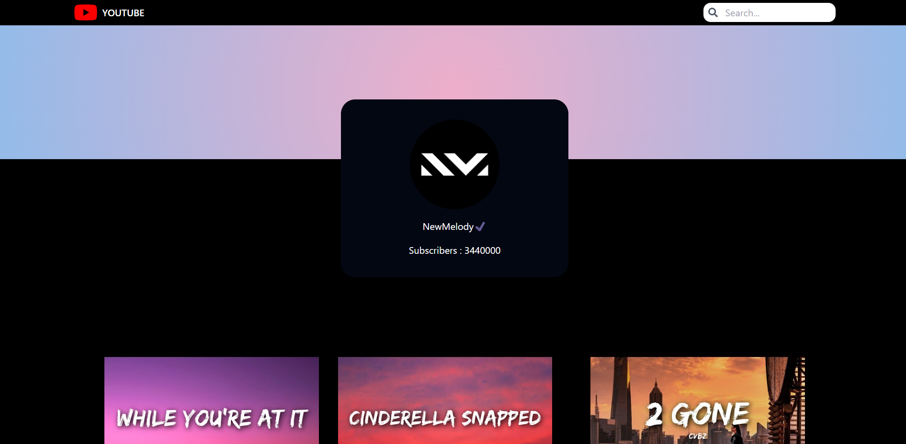
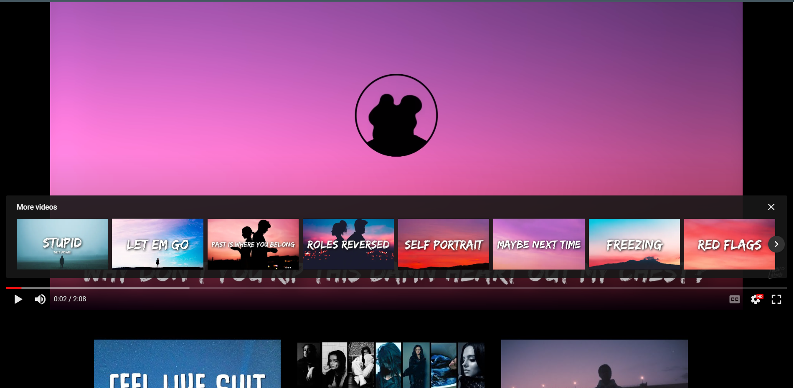
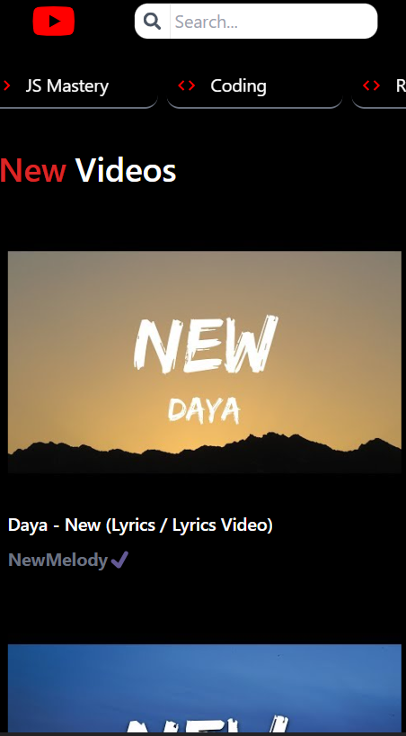
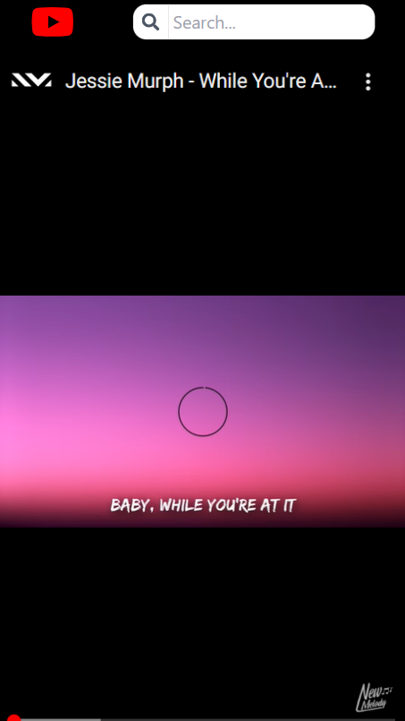

# YOUTUBE - CLONE

<p align="justify">Our YouTube clone website is a fully functional platform that allows users to upload, watch, and share videos. It is built using the React JavaScript library, which enables us to create a dynamic and interactive user interface.</p>

# Images:
<div align="center">



</div>

# Responsive Design:
<div align="center">



</div>

# TECH STACK USED:

- Framework: [REACT](https://react.dev/)
- CSS Framework: [Tailwind CSS](https://tailwindcss.com/)
- RAPID API: [RAPID API](https://rapidapi.com/hub)

## REACT

React is a popular JavaScript library for building user interfaces. It was developed by Facebook and is widely used in web development. React allows developers to create reusable UI components that can be combined to build complex and interactive web applications.

One of the key features of React is its virtual DOM (Document Object Model) representation. React maintains a lightweight in-memory representation of the actual HTML DOM, which allows it to efficiently update and render only the necessary components when there are changes in the application's state. This approach results in faster rendering and improved performance compared to traditional methods.

React follows a component-based architecture, where the user interface is broken down into small, reusable components. Each component encapsulates its own logic and rendering, making it easier to manage and maintain the application. Components can be composed together to create more complex UI structures, and they can also have their own internal state and lifecycle methods.

## Tailwind CSS

Tailwind CSS is a highly customizable CSS framework that provides a utility-first approach to styling. It allows you to rapidly build modern, responsive interfaces by composing small utility classes.

With Tailwind CSS, you can easily create and maintain consistent designs across your application. It provides a wide range of pre-built utility classes for styling elements, responsive layouts, and more.

Learn more about Tailwind CSS [here](https://tailwindcss.com/).

# Deployed on Vercel:
<div align="left">
<p>The Website had been deployed on vercel platform</p><a href="https://youtube-clone-seven-phi.vercel.app/">Live Demo</a>
</div>

<br>


# Installation

To install the code from this GitHub repository, follow the steps below:

1. Clone the repository using Git:

   ```bash
   git clone https://github.com/your-username/your-repository.git
   ```
    Replace your-username with your GitHub username and your-repository with the name of the repository you want to clone.

2. Navigate to the project directory:
   ```bash
   cd your-repository
   ```
   Change directory to the cloned repository.

3. Install any required dependencies:
   ```bash
   # Using npm
    npm install

    # Using yarn
    yarn install

   ```
   This command will install any necessary dependencies for the project. Make sure you have Node.js and the package manager (npm or yarn) installed on your system.

4. Start using the code:
   You can now start using the code from the repository according to the project's documentation or instructions. Refer to any provided README or documentation files for more information. 